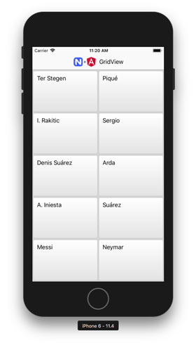

# NativeScript for Angular: GridView



*Screenshots of demo apps*

A simple example of using a NativeScript + Angular. The GridView displays data in separate cells, each cell representing one data item. 

> Make sure that you have NativeScript version ≥2.5 and Xcode. Please see instructions for [installing the NativeScript](https://github.com/Amaster-eu/Install-NativeScript).

Resources used plugins:
*[NativeScript GridView](https://github.com/PeterStaev/NativeScript-Grid-View)
*[NativeScript Gradient](https://github.com/EddyVerbruggen/nativescript-gradient)

> Update: With NativeScript 4.1 plugin *NativeScript Gradient* is no longer needed, because linear gradient support is now built-in. For example:
> ```GridLayout {
>     	background: linear-gradient(to bottom, red, blue, purple);
>     	background: linear-gradient(45deg, yellow, orange);
>     	background: linear-gradient(to right, blue, green);
>     }```

## Installation

This repository includes NativeScript app only for iOS platform. In order to run those execute the following in your shell:

```
$ git clone https://github.com/peterstaev/nativescript-grid-view
$ cd nativescript-grid-view
$ npm install
$ tns run ios
```

